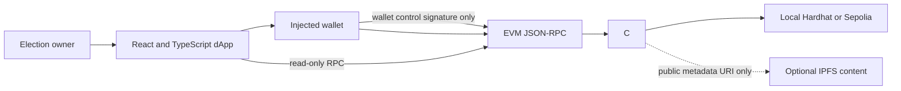

# College E-Voting dApp

A contract-backed academic election-state viewer with a fail-closed voting frontend. The active frontend reads the historical contract but does not submit ballots. The existing `VotingSystem` Solidity contract is a legacy public-ballot contract, not a private voting protocol.

> **Security boundary:** no private voting protocol is implemented. The legacy contract's `castVote(electionId,candidateId)` reveals candidate choice in calldata and `VoteCast`, and candidate counters are public. Do not use this system for secret, public, or legally binding elections.

## Status

**Implemented:** active dApp wallet connection/sign-in, chain reads, read-only legacy election views, a fail-closed read-only UI, and a limited legacy event recount. A read-only `scripts/verify-election.ts` recounts legacy `VoteCast` events independently of the contract result getter.

**Partially implemented:** the legacy public contract enforces its lifecycle, address allowlist and per-wallet duplicate checks. These are not anonymous eligibility or private-vote properties. Local tests validate legacy contract behavior only.

**Not implemented:** anonymous eligibility, election nullifiers, encrypted ballots, valid-ballot proofs, threshold tally/decryption, private receipts, private-protocol verification, multisig/timelock governance, or coercion resistance. Protocol selection is no-go because no compatible maintained stack can be integrated here without an unverified cryptographic bridge.

**Pending external execution:** Sepolia deployment, source verification, real MetaMask E2E, and independent audit. None is claimed.

The former browser-only JSX prototype is isolated under `legacy/` and is not imported by the active HTML entry. It stores simulated ballot selections in browser `localStorage`; it is neither confidential nor blockchain-backed. The active entry is `src/dapp/main.tsx`.

## Architecture



The legacy contract is authoritative only for its public election records. Its allowlist is address-based, its duplicate key is a wallet address, and candidate choice is public. The active UI is read-only for that contract; the legacy `Ownable` owner can still make direct calls outside the dApp. The UI's message signature checks wallet control in this browser tab only; it does not authenticate real-world identity. No multisig or timelock is implemented. See [docs/privacy-protocol-selection.md](docs/privacy-protocol-selection.md) and [docs/privacy-migration-analysis.md](docs/privacy-migration-analysis.md).

## Local development

Requirements: Node.js 22 or newer, npm, and MetaMask for interactive wallet transactions.

```powershell
npm ci
npm run contracts:compile
```

Start these in separate terminals from the repository root:

```powershell
npm run contracts:node
```

```powershell
npm run contracts:deploy:local
npm run contracts:demo
```

Copy `.env.example` to `.env.local`. Set `VITE_CHAIN_ID=31337`, `VITE_LOCAL_RPC_URL=http://127.0.0.1:8545`, and `VITE_VOTING_CONTRACT_ADDRESS` to the address reported by deployment (also recorded in `blockchain/deployments/localhost.json`). Then start the frontend:

```powershell
npm run dev
```

Use the Vite URL it prints. Do not serve this React application by opening `index.html` or using a static-only development server.

### Wallet behavior

1. Add a custom network: RPC `http://127.0.0.1:8545`, chain ID `31337`, currency `ETH`.
2. Import one of the disposable accounts printed by the local Hardhat node. Use these development-only accounts only on the local chain; their keys are public and must never hold real funds.
3. Connect the local contract owner to inspect or administer the legacy demo election.
4. The active frontend deliberately has no ballot submission action. Do not submit a direct `castVote` transaction if ballot secrecy is required; that legacy call publishes the candidate.

The demo seeder labels the election and candidates `DEMO:` and authorizes three local test wallets. It creates no fake transaction receipts or fake vote counts. The demo start time is one minute after seeding and its voting window is five minutes.

## Commands

| Command | Purpose |
| --- | --- |
| `npm test` | Run legacy-contract tests and active-frontend fail-closed regression tests; wallet E2E is not implemented. |
| `npm run contracts:compile` | Compile Solidity with Hardhat 3. |
| `npm run contracts:test` | Run contract lifecycle and security tests. |
| `npm run contracts:node` | Start a local JSON-RPC chain on port 8545. |
| `npm run contracts:deploy:local` | Deploy locally and write address, chain ID, block and ABI manifest. |
| `npm run contracts:demo` | Seed labeled demo state on local chain 31337 only. |
| `npm run typecheck` | Run strict TypeScript checks for the active dApp. |
| `npm run build` | Build static frontend assets. |
| `npm run verify-election` | With `RPC_URL`, `CONTRACT_ADDRESS`, `CHAIN_ID`, `ELECTION_ID`, and `FROM_BLOCK` set, recount legacy public `VoteCast` logs. This is not private-tally verification. |

## Sepolia

No Sepolia contract is deployed. The `contracts:deploy:sepolia` script is intentionally guarded and will refuse to deploy the legacy public-ballot contract. Do not configure a Sepolia address until a reviewed private protocol is selected and genuinely deployed. RPC/private-key setup guidance is in [docs/sepolia.md](docs/sepolia.md); deployment credentials must never use `VITE_*` variables.

## Static and IPFS deployment

Run `npm run build`; `dist/` uses relative asset URLs. Upload the contents of `dist/` to an IPFS pinning service and open the resulting CID through a gateway. The browser still needs an RPC endpoint and a configured contract address. IPFS stores only frontend files and optional public metadata; it is not the source of election state. See [docs/deployment.md](docs/deployment.md).

## Privacy and security

- The active frontend has no candidate-choice submission path and omits `castVote` from its ABI. The Solidity contract is retained and labeled as a legacy public-ballot contract.
- The legacy vote exposes candidate ID in calldata and `VoteCast`; candidate counters are public, and sender-to-choice correlation is direct.
- The active frontend has no persisted ballot selection or candidate-bearing URL. The hash route only selects a view; theme preference storage is unrelated to ballot choice.
- The inactive `legacy/` prototype stores plaintext `candidateId`/`selections` in localStorage. Its receipt/digest is not an anonymous or confidential ballot receipt.
- EVM transactions expose sender, block/time, gas, target contract, calldata and hash. RPC providers may observe IP/request metadata. No relay or network anonymity mechanism exists.
- The wallet-control message uses a random browser nonce and is verified locally in tab memory; it does not verify real-world identity or provide a replay-protected session, and it is not needed to authorize contract calls.
- A public chain provides transaction ordering and tamper-evident history under its consensus assumptions; it does not prove that the eligibility list was fair or that a voter's device is uncompromised.
- Admin control is a single `Ownable` address. No multi-signature governance, timelock, anonymous eligibility, election nullifier, encrypted ballot, validity proof, threshold tally, or coercion resistance is implemented.
- Finalized result getters are lifecycle-gated, but public-chain state and vote transactions remain inspectable before finalization. This is not cryptographic hidden-results voting.

More detail: [docs/privacy.md](docs/privacy.md) and [docs/security.md](docs/security.md).

The evidence-based baseline and readiness assessment are in [docs/current-state-analysis.md](docs/current-state-analysis.md), [docs/production-gap-analysis.md](docs/production-gap-analysis.md), [docs/threat-model.md](docs/threat-model.md), and [docs/production-readiness-report.md](docs/production-readiness-report.md). The gap register explicitly categorizes unresolved work; a PASS in a local build is not a production approval. [docs/privacy-model.md](docs/privacy-model.md) describes public/private/pseudonymous data and why the current ballots are linkable. [docs/security-audit.md](docs/security-audit.md) states that independent third-party audit was not performed.

Additional review material: [docs/smart-contract-security-review.md](docs/smart-contract-security-review.md), [docs/smart-contract-security.md](docs/smart-contract-security.md), [docs/security-analysis.md](docs/security-analysis.md), [docs/security-invariants.md](docs/security-invariants.md), [docs/security-matrix.md](docs/security-matrix.md), [docs/feature-matrix.md](docs/feature-matrix.md), [docs/trust-model.md](docs/trust-model.md), [docs/governance.md](docs/governance.md), [docs/eligibility.md](docs/eligibility.md), [docs/authentication.md](docs/authentication.md), [docs/privacy-analysis.md](docs/privacy-analysis.md), [docs/gas-analysis.md](docs/gas-analysis.md), [docs/disaster-recovery.md](docs/disaster-recovery.md), [docs/verification.md](docs/verification.md), [docs/rpc-failover.md](docs/rpc-failover.md), [docs/sepolia.md](docs/sepolia.md), [docs/known-limitations.md](docs/known-limitations.md), and [docs/production-readiness-boundary.md](docs/production-readiness-boundary.md).

## Project structure

```text
src/dapp/                 Active typed React, wagmi and viem client
blockchain/contracts/     Solidity source
blockchain/test/          Hardhat tests
blockchain/scripts/       Deployment and labeled local demo scripts
blockchain/deployments/   Generated, ignored deployment manifests
docs/                     Architecture, security, flow, deployment and viva notes
legacy/                   Inactive historical JSX prototype; do not deploy
```

## Known limitations

This is not a voting-ready application. The fail-closed UI cannot cast a ballot, while the legacy contract remains directly callable outside the UI and exposes candidate choices. No privacy protocol, threshold tally, decentralized governance, private verification, Sepolia deployment, real-wallet ballot E2E, or third-party audit exists. Do not present it as a private election. See [docs/privacy-protocol-selection.md](docs/privacy-protocol-selection.md) for the blocking protocol decision.
