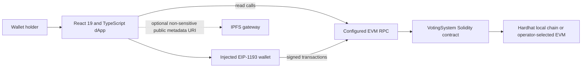
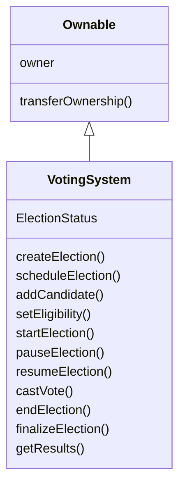

# Architecture

## Current system

There is no application API server. The active client entry is `src/dapp/main.tsx`; it configures wagmi and TanStack Query, then renders `src/dapp/App.tsx`. `src/dapp/contract.ts` contains the client ABI. Election reads use viem with chain-specific configurable fallback endpoints and check the responding chain ID; this is availability fallback, not a provider quorum. Transactions are signed through the injected wallet and authorized by contract access controls.

## Authority boundaries

| Data or action | Authority |
| --- | --- |
| Election names, schedule and lifecycle | Contract state |
| Candidate names and metadata URIs | Contract state |
| Wallet eligibility and one-vote flag | Contract state |
| Final tally | Contract state and finalized result getter |
| Wallet ownership | Injected wallet signature / transaction caller |
| User interface state and selected tab | Browser memory only |
| Candidate image or long-form public description | Not uploaded by this app; a URI may be recorded on-chain |

## Contract organization

One owner controls setup. Candidate and eligibility changes are blocked after an election becomes active. There are no external calls during vote counting, so the current `castVote` path has no reentrancy interaction. The contract is intentionally a single contract for this project slice.

## Authentication

The browser asks the connected wallet to sign a message containing the address, chain ID and random nonce. It recovers the signer locally and keeps an ephemeral wallet-control state for that browser tab. This is not real-world identity verification, a replay-protected server session, or on-chain authorization. Actual administrative and voting permissions are enforced again by the contract using `msg.sender` and `Ownable`.

## Deployment architecture

Hardhat compiles and tests the contract, and the deploy script emits an ignored JSON manifest containing network, chain ID, address, block and ABI. The frontend is a static Vite build with relative asset paths. It can be hosted conventionally or uploaded to IPFS; either way, a browser RPC endpoint and contract address are required.