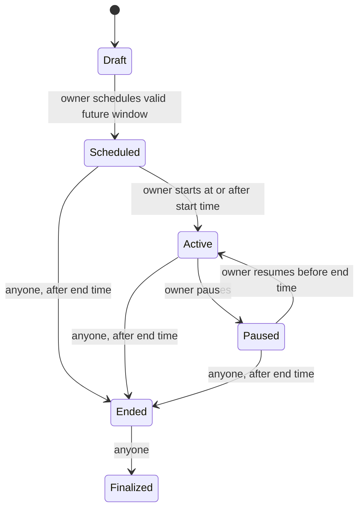

# Smart Contracts

## `VotingSystem`

The contract is Solidity `^0.8.24`, compiled and tested with Solidity 0.8.28 and OpenZeppelin Contracts 5.6.1. OpenZeppelin `Ownable` sets the deployer as the initial election authority.

### Lifecycle

Invalid transitions revert. A pause does not extend the scheduled deadline. The contract checks timestamps for start, resume, vote, and end operations; a frontend clock is not trusted for enforcement.

### Function groups

| Purpose | Functions |
| --- | --- |
| Draft setup | `createElection`, `scheduleElection`, `addCandidate`, `setEligibility` |
| Lifecycle | `startElection`, `pauseElection`, `resumeElection`, `endElection`, `finalizeElection` |
| Ballot | `castVote`, `hasVoted`, `isEligible` |
| Reads | `getElection`, `getElectionStatus`, `getCandidate`, `getCandidates`, `getResults` |

Eligibility and `voterHasVoted` mappings are private at the Solidity ABI level, and per-candidate tallies are not returned by the candidate-list getter. This is not storage secrecy: EVM storage and transactions can be inspected. `getResults` only succeeds after the `Finalized` state, but observers can independently inspect votes earlier.

### Invariants

- Only the `Ownable` account can create or schedule elections, add candidates, modify eligibility, start, pause or resume.
- Schedule start must be in the future and end must be later than start.
- Voting requires `Active`, the timestamp window, eligible caller, unused caller/election pair and valid candidate index.
- Eligibility and candidate setup cannot change after the election enters `Active`.
- `endElection` is permissionless but cannot succeed before the end timestamp.
- `finalizeElection` is permissionless but can only follow `Ended`.
- Counts only increase from accepted `castVote` transactions and cannot be set by an admin.

### Events

`ElectionCreated`, `ElectionScheduled`, `ElectionStateChanged`, `CandidateAdded`, `EligibilityUpdated`, `VoteCast`, and `ElectionFinalized` record key transitions. `VoteCast` includes the candidate ID. The transaction sender is also public, so a vote is linkable to its wallet and choice.

The frontend ABI is in `src/dapp/contract.ts`; the generated deployment manifest also contains Hardhat's full ABI. Any contract change must update the frontend ABI and tests.