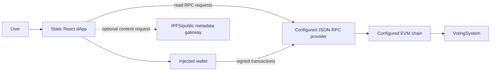

# Threat Model

**System assessed:** current active dApp and current `VotingSystem` contract, review date 2026-09-27. This model does not assume a privacy protocol or governance mechanism that is not present in code. It is not a certification or independent penetration test.

## Security objective and non-objectives

The current implementation can enforce that an eligible wallet submits no more than one accepted vote per election and can derive finalized tallies from contract counters, subject to the chain, contract, deployment, and eligibility-authority assumptions below.

It does **not** provide ballot secrecy, voter anonymity, receipt-freeness, coercion resistance, one-person-one-vote, fairness of the voter roll, private eligibility, censorship resistance, or production-grade administrative governance. `castVote` discloses the candidate ID in public calldata and `VoteCast`; therefore mapping wallet to vote is trivial for a chain observer. Do not use this design for secret or legally binding elections.

## System boundary and data flow

The browser and its local authentication flag are untrusted. The wallet signs transactions. Contract checks are the authority for the implemented election rules. The configured RPC, chain identity, contract address/code, deployment process, owner key, eligibility decision, wallet/device, and chain consensus remain trust dependencies.

## Assets

| Asset | Current location/authority | Security and privacy significance |
| --- | --- | --- |
| Voter eligibility | Contract mapping keyed by election and wallet | Publicly inferable through transaction inputs/storage; incorrectly authorized wallets can vote |
| Ballot secrecy | Not achieved | Candidate ID is visible in transaction calldata/event; no cryptographic concealment |
| Election configuration | Contract election/candidate storage and events | Owner can define identity, schedule, candidates and metadata before activation |
| Candidate configuration | Contract candidate array | Public and frozen after Active; arbitrary strings/metadata URI are allowed |
| Election state | Contract | State transitions gate voting and results |
| Vote integrity | Contract counter increment during `castVote` | Depends on deployed bytecode, EVM execution and chain canonical history |
| Vote uniqueness | `voterHasVoted[electionId][msg.sender]` | Per-wallet, not per-person; publicly linkable |
| Result integrity | On-chain candidate counters/total and Finalized state | Results are reproducible from state but no independent recount/commitment is shipped |
| Audit records | Contract events/transactions | Public; frontend only displays a recent bounded slice |
| Smart-contract ownership | OpenZeppelin `Ownable` owner address | Single-key administrative authority and liveness dependency |
| Administrative keys | Wallet software/operator custody | Compromise can authorize privileged transactions; keys are not stored by app |
| Wallet credentials | Wallet extension/device | Seed/private keys must remain outside app; compromise allows transactions as that address |
| Frontend integrity | Static Vite files delivered by host/IPFS gateway | Modified UI can misrepresent elections or request malicious transactions, although contract checks remain |
| IPFS content | Optional URI only; app does not upload/fetch/verify it | Availability, metadata authenticity and request privacy are unresolved |
| RPC availability and integrity | Configured primary plus optional chain-specific read fallback URLs | Providers can censor, delay, return stale data, observe request metadata; chain-ID check is not an honesty quorum; writes still need wallet signature |
| Blockchain availability and canonicality | Selected EVM network | Congestion, censorship, reorganization, consensus failure affect liveness and finality |

## Trust assumptions

1. The selected chain's consensus and finality behave according to its protocol.
2. The deployed contract address contains reviewed bytecode matching the intended source and compiler configuration. The current UI does not verify this assumption itself.
3. Solidity compiler, OpenZeppelin dependency, Hardhat toolchain and build artifacts are uncompromised and reproducibly obtained.
4. The wallet correctly displays and signs the actual transaction and the user's device/browser is not compromised.
5. The owner/eligibility authority provisions the intended eligible wallets fairly. The current contract cannot prove real-world personhood or eligibility.
6. The RPC provider is available and does not materially mislead reads; no independent fallback is configured.
7. Candidate/election metadata is accurate and appropriate; URIs are not validated or content-pinned by the active UI.
8. If hosted via IPFS, at least one gateway or IPFS peer can retrieve the static frontend. IPFS availability is not guaranteed by a CID alone.

## Attacker analysis

“Current mitigation” describes a concrete existing mechanism only. “Recovery” does not imply that the current app has an automated recovery feature; where it does not, the response is an operator procedure or the election must be aborted/redeployed under documented governance.

| Attacker | Objective, capability and attack surface | Current mitigation | Residual risk and detection | Recovery / response |
| --- | --- | --- | --- | --- |
| 1. Unauthenticated Internet attacker | Discover/configure wrong contract or flood reads; submit arbitrary calls. Public UI/RPC/contract endpoints are exposed. | Contract restricts administrative writes to owner; vote calls require eligibility and lifecycle. | Reads can be abused; unsupported endpoints may be unavailable. RPC/gateway request metrics can detect load, but no monitoring is implemented. | Use another RPC/gateway, keep writes contract-gated, communicate service status. No central rate limiter is required for vote authority. |
| 2. Malicious voter | Vote twice, vote outside window, choose invalid candidate, exploit transaction race, observe others' choices. | Contract checks Active/time/eligibility/unused wallet/valid index atomically; per-wallet flag prevents second accepted vote. | Can use multiple eligible addresses; can observe everyone’s public choice; can front-run/censor transactions through public mempool. Contract tests cover basic duplicate/time checks only. | Reject reverted vote; audit chain state; eligibility authority must address multi-wallet enrollment before activation. Cannot undo accepted ballots. |
| 3. Ineligible voter | Bypass eligibility via frontend tampering or direct contract call. | `eligibleVoters` check is on-chain in `castVote`; frontend is not the authority. | If owner mistakenly or maliciously enrolls address, contract accepts it; no proof of identity. | Review eligibility setup and events before activation; if incorrect before activation, correct and republish. After Active, eligibility is locked; cancel/abort policy is absent. |
| 4. Duplicate voter | Reuse transaction, replay call, or race parallel submissions. | `voterHasVoted` checked/set atomically for election and sender; EVM account nonce serializes same-account transactions. | A person with multiple authorized wallets can vote multiple times; signature/session flags do not solve this. | Check on-chain voted status, reject later transactions. No per-person recovery or identity link is implemented. |
| 5. Malicious candidate | Attempt candidate manipulation, malformed URI/name, or exploit candidate index handling. | Only owner can add; nonempty name and array bounds; additions locked after Active. | Owner can insert any candidate content before activation; no review, candidate consent, string-size cap, URI validation or content commitment. | Inspect all candidates and content before starting; after activation candidate list is immutable. If erroneous, do not start; otherwise stop election only under a future documented procedure. |
| 6. Malicious administrator | Bias eligibility/candidates/schedule, activate at chosen time, pause/resume strategically, or stage unfair election. | Owner actions are public transactions/events; some configuration freezes after Active; vote counter has no setter. | One owner has unilateral setup/start/pause/resume power; no multisig, review window, reason, oversight or snapshot procedure. Active pause can affect opportunity; no time compensation. | Publish evidence and follow external election governance; owner cannot rewrite accepted votes but can influence setup/control. No contract-level remedy after deployment. |
| 7. Compromised administrator wallet | Attacker exercises owner privileges using stolen key. | Contract enforces owner identity, but that is the compromised key. No second factor/multisig exists. | Full setup/timing/eligibility control while owner key remains current; no on-chain alert policy. | If detected pre-election, transfer ownership via inherited Ownable flow using secure operator procedure and deploy/verify replacement if needed. In-progress elections may require abort; no tested recovery runbook. |
| 8. Compromised frontend | Change candidate display/selection, fake status, direct user to malicious contract, request wrong transaction, exfiltrate address/activity. | Contract validates caller eligibility/state/index; wallet confirmation is final authorization; UI warns vote choice is public. | Contract cannot prove UI showed the correct election/candidate. User can sign a valid but unintended candidate ID. No release signature/SRI/CSP policy. | Stop using affected CID/host, compare deployment manifest/source build, publish a known-good CID via trusted channels; users independently inspect transaction calldata/contract. |
| 9. Malicious RPC provider | Return stale/wrong data, suppress logs, deny service, observe queries/IP/timing. | Writes are wallet-signed and contract-enforced on chain; configurable read fallback and reported chain-ID checks exist. | No provider quorum, block-hash comparison, freshness assurance or source verification. | Configure independent fallback endpoints and compare critical state manually; verify against another provider/explorer. No automatic reconciliation exists. |
| 10. Blockchain reorganization attacker | Reorder/revert recently included transactions or exploit temporary fork. | EVM consensus and receipt status provide inclusion on selected chain. | UI treats one receipt as confirmed; no confirmations/finality tracking, reorg listener or status rollback. | Re-read canonical chain and voted state; communicate affected transaction status and allow resubmission only after proving prior vote was not accepted. Current UI has no such automated response. |
| 11. Smart-contract attacker | Exploit state/access control, arithmetic, reentrancy, DoS, malformed inputs. | Solidity checked arithmetic; OpenZeppelin Ownable; no external calls in vote path; candidate bounds/state/time/eligibility checks; 11 unit scenarios. | No independent audit, static analysis, fuzz/invariants, formal verification, explicit candidate caps, or deployment code identity check. | Pause if an exploit can still be paused safely; current pause is owner-only and no recovery/migration policy exists. Preserve evidence, stop frontend writes, deploy a reviewed replacement for future elections. |
| 12. Insider | Leak eligibility, influence enrollment, alter build/deployment settings or misuse operator credentials. | On-chain actions are publicly recorded; `.env.local` is ignored and deployment keys are not browser variables in example. | Eligibility addresses and admin actions are public; deployment is not a two-person/reviewed release. The inactive prototype includes seeded personal-looking data. | Rotate affected keys/credentials, review source and deployment records, notify impacted participants, quarantine legacy prototype. Do not attempt silent state edits. |
| 13. Traffic observer | Correlate user IP, election queries, wallet and timing across RPC, gateways or public mempool. | No passwords/PII are sent by the active UI as part of contract call schema; no custom telemetry backend is present. | RPC sees network metadata; wallet address, timing and vote are public; external font fetch and optional gateways expose requests. | Inform users; allow an independently configured RPC/gateway if implemented; do not claim network anonymity. Already public chain data cannot be withdrawn. |
| 14. Transaction observer | Identify voter choice before/during inclusion and correlate with address. | None for choice secrecy. Confirmation dialog informs voters that choice is public. | Candidate is explicit in calldata and `VoteCast`; voter/wallet is transaction sender. Privacy requirement fails by design. | No remediation for an accepted/public vote. Change protocol before secret election use; do not merely hash the candidate ID. |
| 15. MEV/front-running attacker | Reorder, delay, copy or censor public transactions; observe candidate calldata. | Wallet account nonce and contract eligibility prevent a copied transaction from being accepted as the victim because sender differs. | Can delay/censor; choice visible before confirmation; a victim can be coerced or targeted. No private transaction path or anti-censorship guarantee. | Resubmit only after checking canonical voted state; use alternate RPC/relay if appropriate, documenting extra trust. No current automation. |
| 16. Censorship attacker | Prevent eligible voter/admin transaction inclusion through RPC, validator or network policy. | Read calls can fail over across configured endpoints; wallet may submit through its own endpoint. | No transaction-inclusion guarantee, private relay, deadline appeal or app-level write failover. | Try independent RPC/wallet path, preserve tx evidence, extend/abort only under published governance; current contract cannot change end time after scheduling. |
| 17. Phishing attacker | Trick user into signing a deceptive message or transaction / using a fake portal. | Sign-in text states no funds/vote authorization; vote review names election and candidate; wallet displays transaction request. | No verified origin/domain challenge, signed release, trusted URL policy or contract-bytecode verification. A compromised lookalike UI can mislead. | Reject unknown signatures/transactions; compare official origin/CID and contract/network independently; announce compromised links. No automated phishing recovery. |
| 18. Wallet compromise attacker | Steal voter/admin key and submit transactions as account. | Keys remain in wallet; app never requests private key/seed phrase. Contract still checks roles/eligibility. | Compromised key is indistinguishable from owner/voter; attacker can vote as voter once or administer as owner. | Owner key rotation requires owner authority and may fail after compromise; use multisig before deployment. Voter key loss/replacement has no formal recovery design. |
| 19. Denial-of-service attacker | Exhaust RPC/UI resources, trigger huge data reads, or make essential contract operations costly. | No unbounded per-vote loop; vote count update is O(1); owner-only candidate append. | Election/candidate count and metadata sizes are uncapped; `getCandidates`/`getResults` return full arrays; audit scans up to 10k blocks in one request. RPC can refuse large reads. | Use direct individual candidate reads/pagination from an improved API or bounded contract calls; no current pagination. Limit configuration before activation. |
| 20. Colluding administrators | Coordinate to bias eligibility/setup/timing, suppress opposition or pause strategically. | Current contract has only one admin, so “collusion” currently means collusion among external operators controlling that key/eligibility process. Actions are public. | No independent quorum, multisig or observers; public event logs do not establish fair intent. | Introduce separate governance keys/quorum and published approval process; for current deployments disclose actions and do not use in contested elections. |
| 21. Coercive attacker | Force voter to reveal choice, transact while observed, or prove how they voted; buy/sell a vote. | Confirmation warns choice is public; UI avoids rendering a selected-choice receipt after confirmation. | Public tx hash/calldata/event proves choice; no coercion resistance, revoting, fake credential, deniable receipt, or private ballot. | No technical recovery; treat coercion resistance as out of scope and do not use in settings where coercion is plausible. |
| 22. Malicious infrastructure provider | Compromise static host, DNS, CDN, IPFS gateway/pinner or RPC service. | Contract enforces state rules independent of UI; IPFS is optional; no centralized app API. | Static UI can be replaced; one RPC can mislead/censor; CID retrieval/pinning not checked; user may not distinguish authentic frontend. | Re-host known build under reviewed CID, use alternate gateways/RPCs, verify contract independently, publish incident notice. The active UI does not yet perform these checks. |

## Security properties and residual risk

### Properties currently enforced by contract

For election `E`, wallet `A`, and a valid canonical execution:

- A successful vote requires `status(E) = Active` and `startsAt(E) <= block.timestamp < endsAt(E)`.
- A successful vote requires `eligible(E,A) = true`.
- The contract permits at most one successful `castVote` for `(E,A)` because the same transaction checks and sets `voterHasVoted[E][A]`.
- Candidate configuration and eligibility writes reject states other than Draft/Scheduled.
- `getResults(E)` succeeds only when `status(E) = Finalized`; count mutation paths in the current contract are limited to accepted `castVote` calls.

### Properties not established

The code does not establish one human per wallet, ballot secrecy, correctness/fairness of eligibility issuance, availability, censorship resistance, finality after one receipt, the authenticity of configured address/source, safety of the browser/RPC/wallet, independent completeness of the audit view, or suitability for public elections.

## Detection and incident response baseline

Current detection is limited to public state/events, wallet/RPC errors and manual operator review. No monitoring, alert threshold, anomaly detector, structured incident log, on-call policy or tested recovery automation exists. Incident handling should therefore at minimum:

1. Stop promoting the affected frontend/deployment and preserve CID, bytecode, tx hashes, RPC/block references and operator logs.
2. Independently query at least one separate RPC/explorer for chain ID, contract code, election state and relevant events.
3. Notify voters/admin observers of the affected network/election, known impact and whether another transaction must be avoided.
4. Do not delete or silently mutate public records. Any replacement deployment requires a public cutover decision and new address.
5. Treat key compromise, exposed candidate choice, eligibility error, reorg, and bad metadata as distinct incidents; ballot secrecy cannot be restored after a public vote.

## Threat-model change triggers

Re-review this model before adding anonymous proof systems, multisig/timelock, contract upgrades, metadata fetching, indexers, user-supplied RPC, voting changes, cross-chain support, signatures with backend verification, or any voter identity integration. These alter trust assumptions and attack surface.
