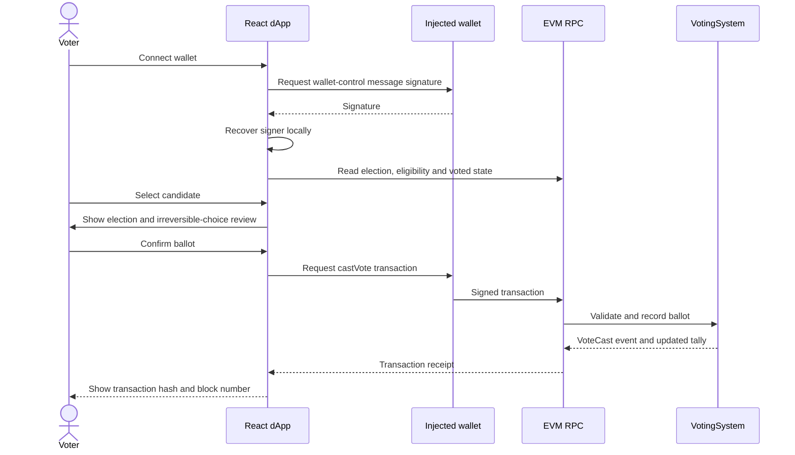

# Voting Flow

## Voter sequence

## Transaction states

The interface displays wallet submission and receipt confirmation separately. Wallet rejection is shown as rejected; RPC or contract reverts are shown as failed with a human-readable summary. The transaction hash links to Etherscan for Sepolia. A local Hardhat chain has no public explorer.

The hash and block number prove that a transaction was included, not that the vote was secret. The UI deliberately does not save a candidate choice in browser storage or display a choice-specific receipt after confirmation.

## Administrator sequence

1. The owner connects and signs in.
2. Create a draft election on-chain.
3. Add candidate names and optional public metadata URIs.
4. Add or remove eligible wallet addresses.
5. Schedule a future start and end.
6. At or after start time, submit `startElection`.
7. Optionally pause and resume before the end timestamp.
8. After the end timestamp, submit `endElection` and then `finalizeElection`.

The contract remains authoritative for permissions and transition rules. The frontend's role indicator is only presentation.